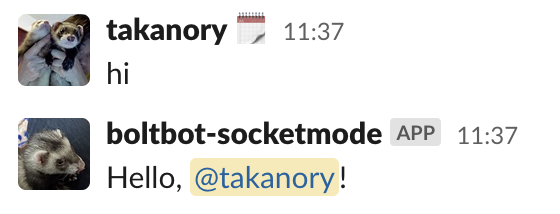

# socket modeでのbot作成

* Bolt for Pythonを使ってslackbotを作ってみる
  * [Bolt for Python](https://slack.dev/bolt-python/concepts)
* Socket Modeで接続する
  * [Intro to Socket Mode](https://api.slack.com/apis/connections/socket)

## Slackアプリを作成する

* https://api.slack.com/apps/new からアプリを作成
* Socket Modeを有効化
  * Socket Mode→Enable Socket ModeをOn→app level tokenをGenerate→`xapp-...` をメモ
* Eventを登録
  * Event Subscription→Enable EventsをOn→Subscribe to bot events→Add Bot User Event→`message.channels`, `messsage.groups` を追加→Save Changes
* パーミッション設定
  * OAuth & Permissions→Add an OAuth Scope→`chat:write` を追加→Install to Workspace→Allow→`xoxb-...` をメモ
* botをチャンネルに招待
  * `/invite @botname`

## botのプログラムを作成

* プロジェクトを作る

```bash
$ git clone git@github.com:takanory/boltslackbot.git
$ cd boltslackbot
$ python3.10 -m venv env
$ source env/bin/activate
(env) $ pip install -r requirements.txt  # slack-bolt と slask-sdk が入る
(env) $ cd socket-mode
```

* 環境変数にトークンを設定する
  * your-app-token: Basic InformmationページのApp-Level Tokens
  * your-bot-token: OAuth & PermissionsページのBot User OAuth Access Token

```bash
(env) $ export SLACK_APP_TOKEN=xapp-<your-app-token>
(env) $ export SLACK_BOT_TOKEN=xoxb-<your-bot-token>
```

* `app.py` を作成して実行する

```python
import os

from slack_bolt import App
from slack_bolt.adapter.socket_mode import SocketModeHandler

app = App(token=os.environ["SLACK_BOT_TOKEN"])


@app.message("hi")
def say_hello(message, say):
    user = message['user']
    say(f"Hello, <@{user}>!")


if __name__ == "__main__":
    SocketModeHandler(app, os.environ["SLACK_APP_TOKEN"]).start()
```

```bash
(env) $ python app.py
⚡️ Bolt app is running!
```



## モーダルの実装

* 以下の記事を参考に実装
* [Slack アプリでのモーダルの使い方完全ガイド - Qiita](https://qiita.com/seratch/items/0b1790697281d4cf6ab3)
* 以下の処理の流れとなっている
  * `choice_modal()` 関数: `$choice2` メッセージ送信→応答メッセージでモーダル表示用のボタンを表示
  * `handle_choice_modal()` 関数: ボタンをクリック→モーダルを表示
  * `handle_choice_modal_view()` 関数: モーダルに入力して「送信」→結果のメッセージを送信